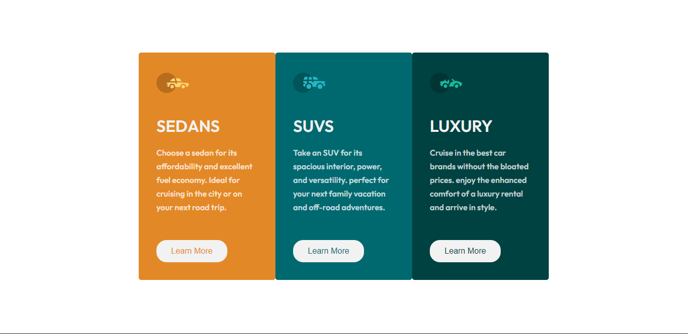

# Frontend Mentor - Solución del componente de la tarjeta de vista previa NFT

Esta es una solución al [reto de Componente de tarjeta de vista previa de 3 columnas](https://www.frontendmentor.io/challenges/3column-preview-card-component-pH92eAR2-). Los retos de Frontend Mentor te ayudan a mejorar tus habilidades de codificación construyendo proyectos realistas. 

## Resumen

### El reto

Los usuarios deben ser capaces de:

- Ver el diseño óptimo en función del tamaño de la pantalla de su dispositivo
- Ver los estados hover de los elementos interactivos

### Captura de pantalla

### Links

- 
- URL del sitio: [Add live site URL here](https://guill-mh.github.io/previewColumnCard/)

### Construido con

- Semantic HTML5 markup
- CSS custom properties
- Flexbox
- CSS Grid
- Sass

### Que aprendi

Aprendi conceptos basicos de HTML Y CSS, tambien sobre el procesador Sass, adaptar un diseño para movil.

### Continuar con el Desarrollo

Quiero seguir aprendido mas a fondo HTML y CSS para tner bases solidas, tambien quiero centrarme en hacer codigo mas ordenado y limpio es algo en lo que seguire trabjando.

### Recursos

- [flexbox]https://css-tricks.com/snippets/css/a-guide-to-flexbox/ - Me ayudo a recordar algunas propiedades de flexbox y su funcionamiento de cada propiedad.

## Author
- Frontend Mentor - [@Guill-MH](https://www.frontendmentor.io/profile/Guill-MH)
